# Task
Deploy a simple application on [AWS lambda](https://aws.amazon.com/lambda/) using [APP-SYNC Dynamo DB GraphQL](https://aws.amazon.com/appsync/), [Elastic CACHE](https://aws.amazon.com/elasticache/)


### Flow
1. Make an api to save data into Appsync db
2. Get a data from Appsync db
3. Get from App-sync in parallel store it in Elastic cache
4. Make 2nd get request if present in Elastic cache get it from elastic
5. cache else make request to app-sync db
6. Deploy the api code in lambda function.


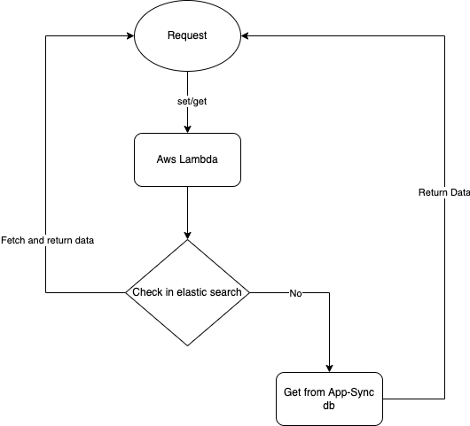

## File Structure

```.
├── DockerFile -> Docker file to make binaries for lambda function
├── app_sync.py -> Handler to process app_sync requests
├── attachments -> Git readme attachments
├── aws_config.py -> Environment variables (Secure way)
├── elastic_cache.py -> Aws Elastic cache handler
├── main.py -> Main file to interact with lambda and aws
├── readme.md 
└── requirements.txt -> All of the requirements
```

## Making AppSync 
1. Go to AWS AppSync 
2. Create api
3. Build from Scratch
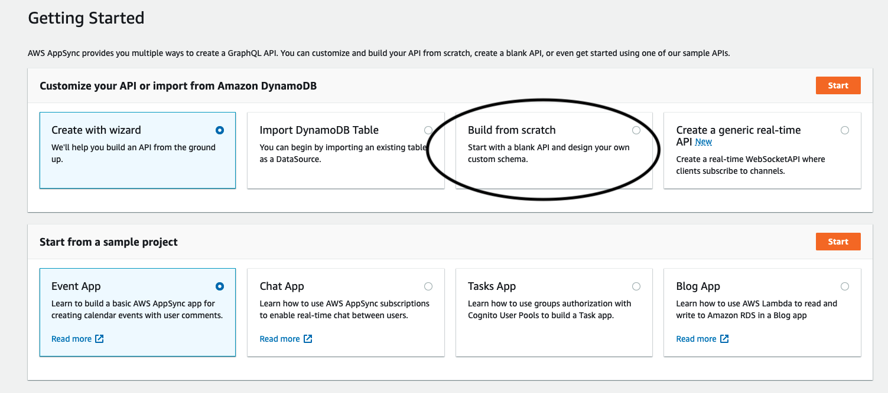
4. Give your appname (MyCar)
5. Edit Schema
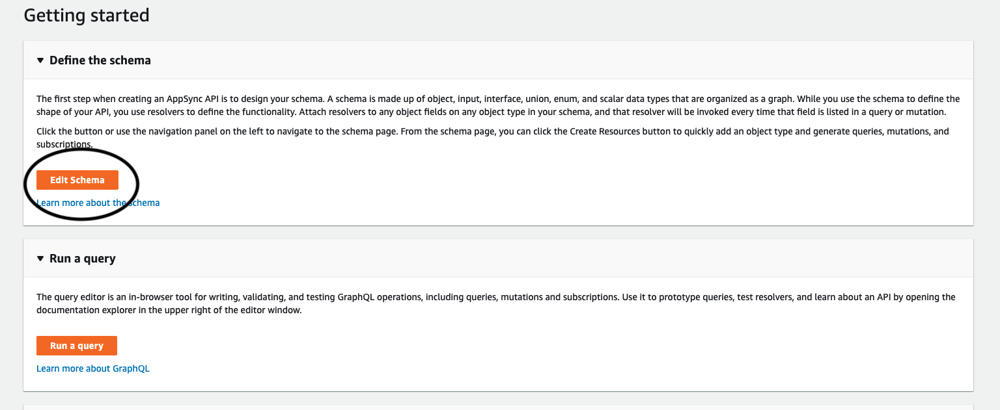
6. Create Resources
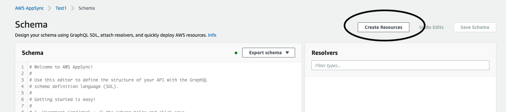
7. Give your schema in the box
```sql
type MyCustomType {
	id: ID!
	name: String!
	content: String!
	price: Int
	rating: Float
}
```
8. Got at the bottom of the page and create
9. Go to the queries section
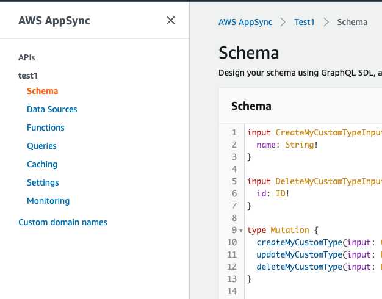
10. Check your schema by query
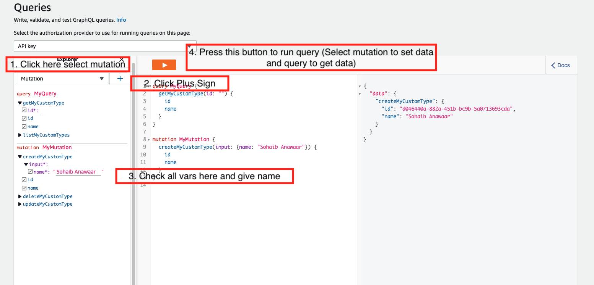
11. If you want to set and get data through python see file [app_sync.py](app_sync.py)


## Deployment on AWS lambda

We need to deploy our code onto the lambda server. Lets see how to deploy things on aws lamba functions. 


We need docker to install get the requirements.txt packages first, becaues we cannot install our requirements.txt on lambda aws. So lets do it with the help of docker. Because for-example if you are working on windows machine and lambda server you made is of linux your windows binaries will not work on lambda linux server thats why we are using docker to make binaries. 


Steps to add python packages in AWS lambda layers
Step 1: Go to the AWS management console.

Step 2: Click on create function.
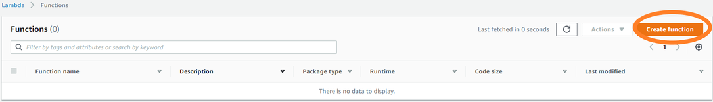

Step 3: Create a lambda function named “mylambda”

Step 4: Choose Python 3.9 and x86_64 architecture and click on create a function

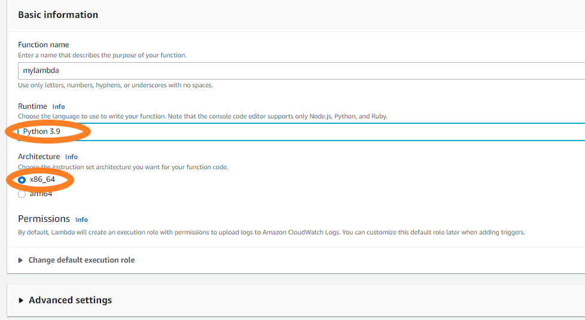

Step 5: Now try importing the requests module in your lambda function. So, create an event named “myevent” by clicking the down arrow on the test button.
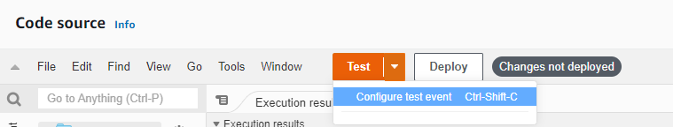
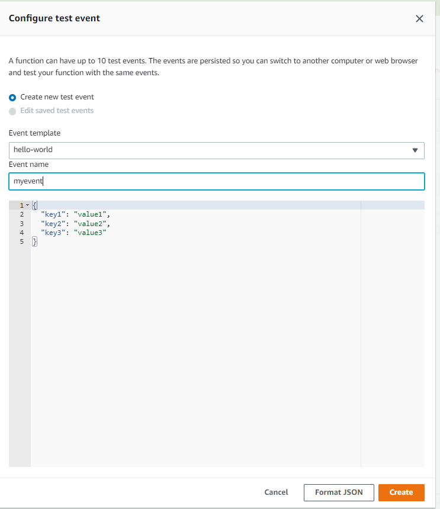

Step 6: Deploy the function.
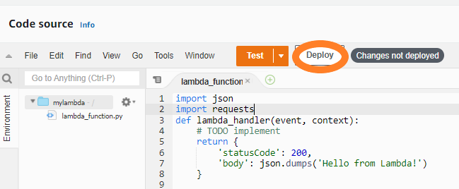
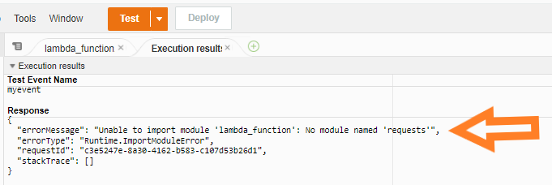

To create a lambda layer we need to create a zip file containing all the dependencies for the ‘requests’ package and upload it to our layer. To create this zip file we will make use of docker.

Why docker?
Since lambda uses the Amazon Linux environment, if you are using windows and create a zip file of dependencies it might not work while you run your lambda function. After you finish setting up docker, open the command prompt and run:

Make a file name ```DockerFile```
Put the following code in ```DockerFile```

```bash
FROM amazonlinux:2.0.20191016.0
RUN yum install -y python37 && \
    yum install -y python3-pip && \
    yum install -y zip && \
    yum clean all
RUN python3.7 -m pip install --upgrade pip && \
    python3.7 -m pip install virtualenv
```


``` bash
# Build docker image with file
docker build -t lambdalayer:latest -f DockerFile .
# Run docker
docker run -it --name lambdalayer lambdalayer:latest bash
# Install nano
yum update and yum install nano
# Nano requirements.txt file paste your requirements.txt here
nano requirements.txt
# Install packages
pip install -r requirements.txt
# Make virtual environment
python3.7 -m venv virtualenv
# Activate environment
source virtualenv/bin/activate
# Install requirements
pip install -r requirements.txt -t ./python
# Zip packages binaries
zip -r python.zip ./python/
# exit docker
exit
# Copy binaries
docker cp lambdalayer:python.zip ~/Desktop/

```

Step 7: Now add layers
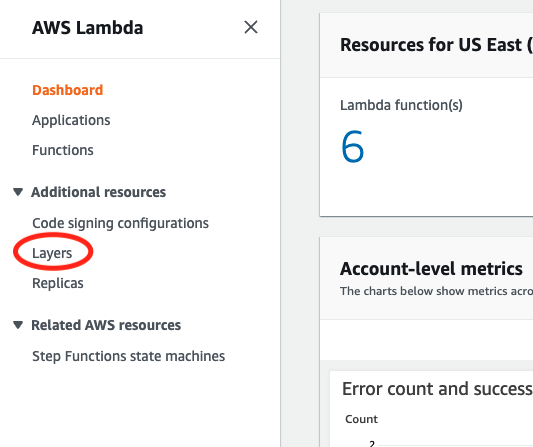
Create layer
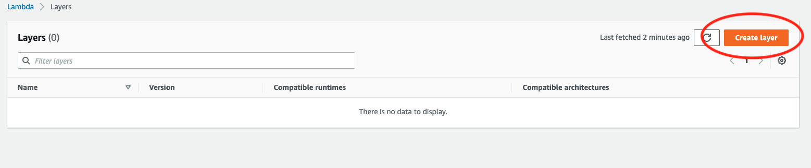
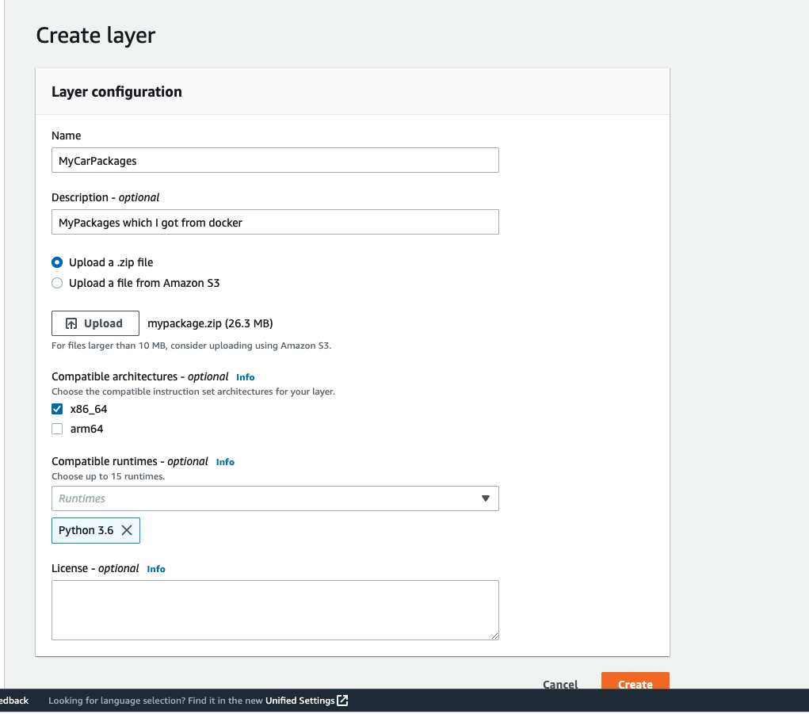

Step 8:
Go to confrigation of lambda functioon
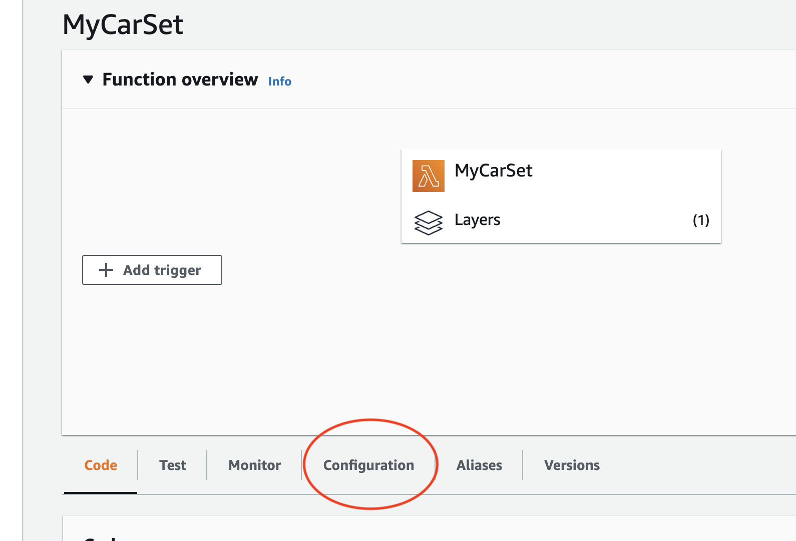

Go to function url to get a url to access lambda
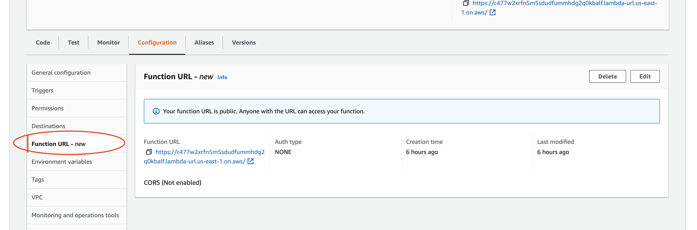
Now from the function url you can access your lambda function
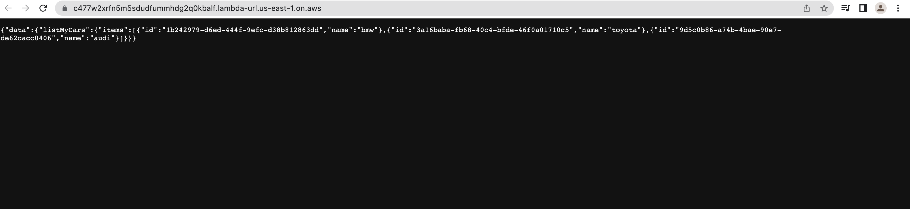


# Get Car list 
Click here to get car lists [GET](https://c477w2xrfn5m5sdudfummhdg2q0kbalf.lambda-url.us-east-1.on.aws/)


